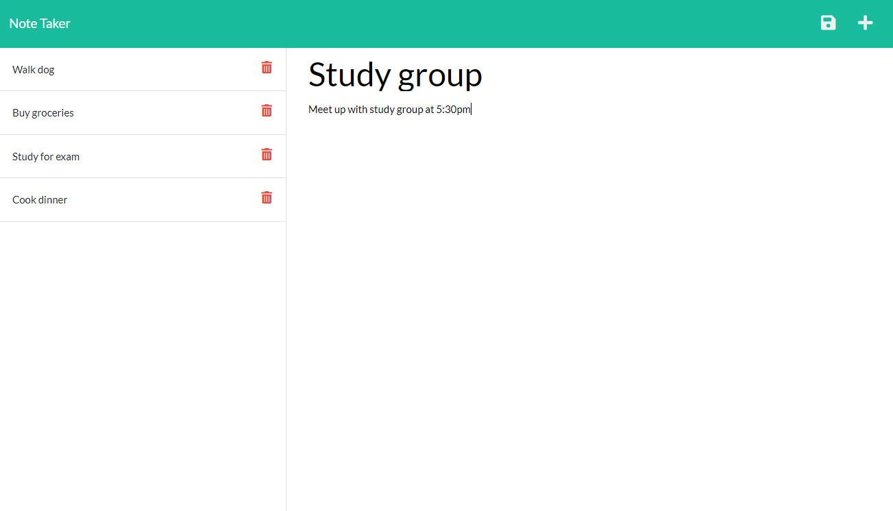

# Note-Taker

[link]: https://github.com/n7-gil/Note-Taker

The purpose of this assignment was to generate a fully functional website that allows you to write and save notes. When the website is launched and the home screen is presented, the maing button is clicked taking the user into the app. In the center of the page, the user types in the note's title and then a description of the note underneath. Once the note is complete, the user then saves the note with the save button on the top right button. Saved notes appear on the left side of the website and can be clicked to open them again.



# Installation

Use

```js
npm install
```

Run on

```js
server.js;
```

# Deployed Url

[Deployed-App](https://n7gil-note-taker.herokuapp.com/)
